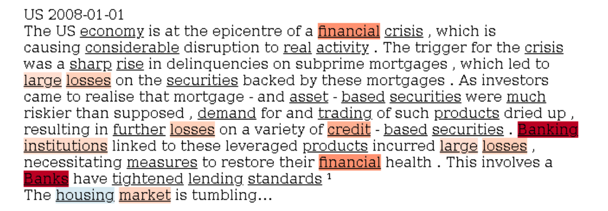

Working Paper (coming soon)

---

#### Abstract
We use machine learning techniques on textual data to identify financial crises. One of the challenges in financial crisis management is being able to determine whether a country is in a crisis or not, or what type of crisis a country is in, especially in real time. The onset of a crisis and its severity also has implications for real economic activity and, hence can be a valuable input into macroprudential, monetary, and fiscal policy. The academic literature and the policy realm rely mostly on expert judgment to determine crises. Consequently, the identification of crises and the buildup-phases of vulnerabilities are usually determined with hindsight. Although we can identify and forecast a good portion of various degrees of crises worldwide with traditional econometric techniques using readily available markets data, we find that textual data helps in reducing false-positives and false-negatives in out-of-sample testing of such models, especially when the crises are considered more severe.

---

#### Figure 11: US OECD Economic Outlook with LIME Highlighting"

