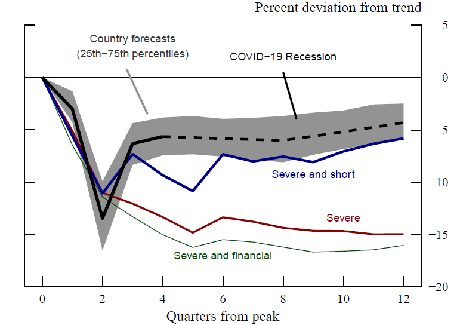

[FEDS Note](https://www.federalreserve.gov/econres/notes/feds-notes/the-global-recovery-lessons-from-the-past-20210622.html)

---

#### Abstract
The downturn in global economic activity caused by the COVID-19 pandemic was unique both for its causes and for its severity. Even though, on a global scale, the recent contraction is unprecedented in modern times, it is useful to look at the consequences of large recessions which affected individual countries in the past. In this note, we draw insights about the ongoing global recovery by looking at the evolution of several economic indicators in the aftermath of past recessions.

We find that, following severe contractions, output typically remains well below its pre-recession trend in the medium term. This behavior is more marked for severe recessions that are accompanied by financial crises, while severe but short contractions result in a faster recovery. The post-COVID-19 recovery appears to be much more rapid than in standard severe recessions, putting it roughly in line with severe and short recessions of the past.

We argue that outsized policy interventions in response to COVID-19 provided unprecedented support to households and firms, preventing a more prolonged downturn. Furthermore, productivity is likely to be more resilient compared to past slumps, which should help to sustain the pace of the recovery in the coming years.

---

#### Figure 1: GDP Recovery after "Severe Recessions"

---

#### Citation
Caldara, Dario, Matthew DeHaven, Francesco Ferrante, and Matteo Iacoviello (2021). "The Global Recovery: Lessons from the Past," FEDS Notes. Washington: Board of Governors of the Federal Reserve System, June 22, 2021, https://doi.org/10.17016/2380-7172.2931.